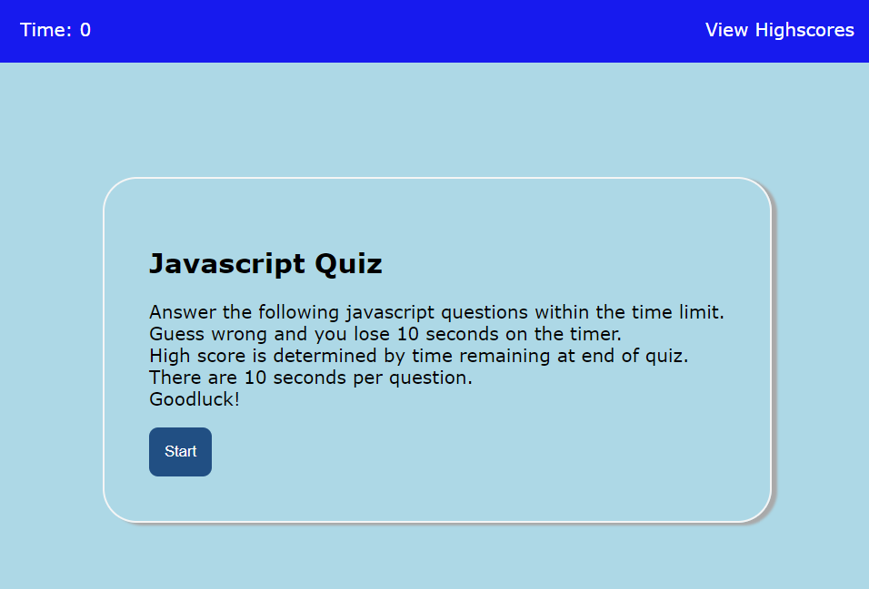

# Javascript Quiz
This is my Javascript quiz created as a coding boot camp student.
It is a timed quiz designed on JavaScript fundamentals and stores a users high scores.
This quiz is created so that I can gauge my progress compared to my peers.

## Table of contents
* [General info](#general-info)
* [Technologies](#technologies)
* [Setup](#setup)
* [Sample images](#Sample-images)

## General info
This is a short timed quiz on general knowledge of Javascript. 
When the user clicks the start button, then a timer starts and the user is presented with a question.
When the user answers a question, then the user is presented with another question. 
When the user answers a question incorrectly, then time is subtracted from the clock.
When all questions are answered or the timer reaches 0, Then the game is over. 
When the game is over, Then the user can save their initials and score.
	
## Technologies
This project is created with:
* Html
* CSS
* Javascript

## Setup
To run this project, please visit the url https://cleetidwell.github.io/Javascript-Quiz/

## Sample images

